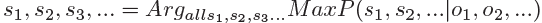
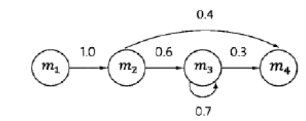

# 通信模型
通信的本质就是一个解编码和传输的过程。
**通信模型**：

在通信中，根据接收端信号来推测信号源发出的信号的方法：**从所有的源信息中找出最可能产生出现观测信号的那个信息**

用数学表述的形式就是： 

经过贝叶斯变换并去除输出信息的概率这一个常数值可以得到： 

# 隐马尔可夫假设

19世纪，概率论的发展从对相对静态的**随机变量**的研究发展到对随机变量的时间序列s1，s2，...，sn的研究，即**随机过程**的动态研究。

马尔科夫在研究天气的这种不确定性时，提出了一阶马尔科夫假设：**随机过程中各个状态st的概率分布，只和它的前一个状态s(t-1)有关**

## 马尔科夫链

# 隐马尔可夫模型
在马尔科夫链上的拓展: **任意时刻t的状态st是不可见的**
## 独立输出假设
在每个时刻t会输出一个符号Ot，而且Ot和St相关且仅仅和St相关。

通信的解码问题可以通过隐马尔科夫模型来解决。

同理，此求解过程仍然是使用事件发生次数来进行概率统计。

# 隐马尔科夫模型的训练
## 三个基本问题

1. 给定一个模型，如何计算某个特定的输出序列的概率；
2. 给定一个模型和某个特定的输出序列，如何找到最可能产生这个输出的状态序列；
3. 给定足够量的观测数据，如何估计隐马尔可夫模型的参数。
## 解决方法

1. Forward-Backward算法
2. 维特比算法
3. Expectation-Maximization过程
