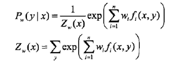

## 逻辑斯蒂回归模型
逻辑斯蒂回归模型是由以下条件概率分布表示的分类模型。逻辑斯蒂回归模型可以用于二类或者多类分类。

其中，x为输入特征，w为特征的权值。然而在此图片中w应该为w的转置。 
逻辑斯蒂回归模型源自逻辑斯蒂分布，其分布函数F(X)是S型函数，逻辑斯蒂回归模型是由输入的线性函数表示的输出的对数几率模型。
## 最大熵模型
最大熵模型是由以下条件概率分布表示的分类模型。最大熵模型也可以用于二类或者多类分类。

其中，Zw(x)是规范化因子，fi是特征函数，wi是特征的权值。
## 最大熵原理

最大熵模型可以由最大熵原理推导得出。最大熵原理是概率模型学习或估计一个准则。最大熵原理认为在所有可能得到概率模型(分类)的集合中，熵最大的模型是最好的模型。
而熵最大则是**所有的未知情况等可能性**。
最大熵原理应用到分类模型的学习中，有以下约束最优化问题：

求解此最优化问题的对偶问题得到最大熵模型。
## 对数线性模型
逻辑斯蒂回归模型与最大熵模型都属于对数线性模型。
## 极大似然估计
逻辑斯蒂回归模型及最大熵模型学习一般采用极大似然估计，或者是正则化的极大似然估计。逻辑斯蒂回归模型及最大熵模型学习可以形式化为无约束最优化问题。求解该最优化问题的算法由改进的迭代尺度法、梯度下降法、拟牛顿法。
