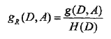
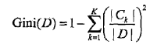

# 决策树模型
分类决策树模型是表示基于特征对实例进行分类的树形结构。
决策树可以转换为一个if-then规则的集合，也可以看做是定义在特征空间划分上的类的条件概率分布。其中，每一个叶节点就表示一个类。
# 决策树学习
决策树学习的目的是构建一个与训练数据拟合很好，并且复杂度小的决策树。
由于从可能的决策树中直接选择最优决策树是NP完全问题，现实中常采用启发式方法学习次优的决策树。什么是启发式方法？？？
# 决策树算法
决策树算法由三部分构成：
- 特征选择
- 树的生成
- 树的剪枝

常用的算法由ID3, C4.5，CART

## 特征选择
特征选择部分中往往只留下对训练数据有足够分类能力的特征。
常用的特征选择的准则有：
### 信息增益(ID3)
其表示的是样本集合D对特征A的信息增益, 其被用于ID3算法中。

其中，H(D)是数据集D的熵，H(Di)是数据集Di的熵，H(D|A)是数据集D对特征A的条件熵。Di是D中特征A取第i个值的样本子集，Ck是D中属于第K类的样本子集。n是特征A取值的个数，K是类的个数。
### 信息增益比(C4.5)
其表示的是样本集合D对特征A的信息增益比，其被用于C4.5算法中。

其中，g(D,A)是信息增益，H(D)是数据集D的熵。
### 基尼指数(CART-classification and regression Trees)
#### 样本集合D的基尼指数

#### 特征A条件下集合D的基尼指数

