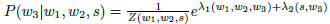

当我们需要对一个随机事件的概率分布进行预测时，我们的预测应当满足全部已知的条件，而对未知的情况不要做任何主观的假设。

在这种情况之下，概率分布最均匀，预测的风险最小。由于此时概率分布的信息熵最大，所以人们称这种模型为“最大熵模型”。

信息论之父乡农证明：对任何一组不自相矛盾的信息，这个最大熵模型不仅存在，而且是唯一的。并且，他们都有同一个非常简单的形式：指数函数。
**最大熵模型表示如下：**

其中，w3是要预测的词，w1和w2是它的前两个字，也就是其上下文的一个大致估计，s表示主题。Z是归一化因子，保证概率之和为1。
