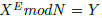

# 密码设计基本原理
1. 根据信息论，密码的最高境界是敌人在截获密码之后，对我方的所知没有任何增加，用信息论的专业术语来说，也就是信息量没有增加。
2. 一般而言，当密码之间分布均匀并且统计独立时，提供的信息最少。均匀分布使得敌人无从统计，而统计独立能保证敌人即使看到一段密码和明码之后，不能破译另一段密码。

# 密码系统设计
1. 找一个很大的素数P和Q，然后计算N = P * Q， M = (P - 1) * (Q - 1)；
2. 找一个和M互素的整数E；
3. 找一个整数D，使得E * D 除以 M 余 1；

**注：**  其中E是公钥，谁都可以用来加密，D是私钥，用来解密。乘积N是公开的，即使被人知道也没关系。
比如，这样对X加密得到密码Y，在不知道D时谁也无法将其破解了。因为其破解公式为

**该过程可以表示为**

至今的研究结果表明最好的方法还是对大数N 进行因数分解，即用过N反过来找到P和Q，这样如果能够找到，那么这个密码就被破解了。

前几年破解的RSA-158 密码：

