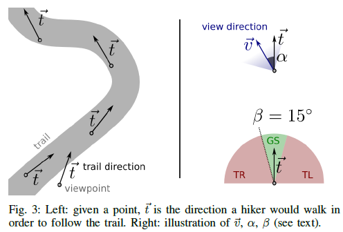
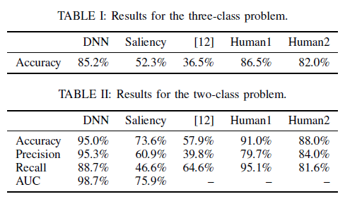

#  A Machine Learning Approach to Visual Perception of Forest Trails for Mobile Robots
|               | A Machine Learning Approach to Visual Perception of Forest Trails for Mobile Robots |
| ------------- | -------------            |
| 作者信息 |  Alessandro Giusti1 et al. Dalle Molle Institute for Artificial Intelligence (IDSIA)  |
| 发表情况 |  IEEE ROBOTICS AND AUTOMATION LETTERS. PREPRINT VERSION. ACCEPTED NOVEMBER, 2015      |
| 被引次数 | 15 until 20170208             |
| 阅读时间 | 2017年2月8日--9日              |
| 论文领域 | Visual-Based Navigation; Aerial Robotics; Machine Learning; Deep Learning        |  
| 技术难点 | 小径与周围环境像素融合较好，使用传统的基于像素差异的方法进行小径识别难以有好的效果       |
| 主要创新 | 实现了 基于DNN的小径感知技术，并提供了实验数据集以及视频进行支撑 |

## 原文摘要
通过在小路上行进的机器人的视线，我们研究了从单目图像进行森林或者山峦小径感知的问题。之前的文献专注于小径分割(trail segmentation) 以及使用诸如显著图像或者外观对比(image saliency or appearance contrast)等的低级特征。我们基于将DNN(Deep Neural Network)最为一个监督图像分类器提出了一种不同的方法。通过对完整图像的一次操作，我们的系统在与视角方向的比对下输出了小径的主要方向。基于一个大型的真实世界的数据集，定性以及定量的结果显示我们的方法优于选择的方法，同时，在对同一个图像方向分类任务的测试中我们系统的准确性可以媲美人类的准确性。初步的关于在看不见得到小径中的螺旋翼控制信息的结构被报道出来了(此文)。据我们所知，这篇文章是第一篇描述一种使用四旋翼微型飞行器(quadrotor micro aerial vehicle)感知森林小径的方法的文章。

## 总体思路
首先让骑行者沿真实的林间小径进行骑行，该人的左边，中间和右边分别佩戴三个相机(中间相机就是得到的t，其alpha约为0，左右alpha绝对值为-30，,30，我猜是对中间相机的修正),进行任务数据的采集，让机器人进行学习，然后在测试集中将我们提出的方法与当前提出的方法以及真人选择道路的准确率进行比对，然后说明此方法的效果。 
  

符号解释: v是相机的光轴方向，t是沿小径骑行的方向，alpha是v与t之间的夹角，beta是设定的进行转向决策的方向。

我们将小径的识别视为分类问题，“三类分类问题”指的是左转，直行和右转，“两类分类问题”指的是直行，非直行。结果显示，在一定程度上基于DNN的方法效果还是不错的。
