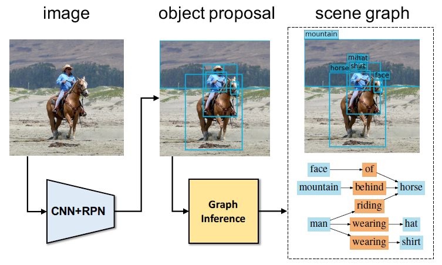

#  Scene Graph Generation by Iterative Message Passing

## 基本信息
|               | Scene Graph Generation by Iterative Message Passing |
| ------------- | -------------            |
| 作者信息  | 李飞飞 Li Fei-Fei             |
| 发表情况 | 2017年1月10日于arxiv           |
| 被引次数 | 0 until 20170205              |
| 阅读时间 | 2017年2月4日--6日              |
| 论文领域 | Scene Graph Generation, CV    |
| 参考资料 | http://www.jiqizhixin.com/article/index/id/2191 |
## 主要创新
在理解视觉场景时，不再像之前只是理解单独的物体，而是将物体之间的关系(提供了丰富的关于这个场景的语义信息(semantic information).)进行重点考虑。
## 整体思路
使用场景图明确地对物体及其关系进行建模。提出了一种全新的端到端模型，其可以从输入图像中生成这种结构化的场景表征(scene representation)。该模型可以使用标准RNN解决场景图推理问题(scene graph inference problem)以及通过信息传递(message passing)学习迭代式地提升其预测能力。同时在其中使用到的联合推理模型可以利用语境线索(contextual cues)来更好地预测物体及其关系。
## 问题引入

目标检测器通过关注单个的物体来感知一个场景。这使得即使是一个完美的检测器也会在两个语义上有明显区别的图像上得到相似的输出（第一行）。我们提出了一种场景图生成模型，其以图像作为输入，然后可以生成基于视觉的（visually-grounded）场景图（第二行右图），该场景图捕获到了图像中的物体（蓝色节点）以及它们之间配对的关系（红色节点）。
## 模型结构

我们的模型的架构概览。给定一张图像作为输入，该模型首先使用一个 Region Proposal Network (RPN) [32] 产出一个目标提议（object proposals）集合，然后将从目标区域提取出来的特征传递给我们全新的图推理模块（graph inference module）。该模型的输出是一个场景图 [18]，其包含一个本地化的目标集合、每个目标的类别以及每个目标对之间的关系类型。

该模型的架构图示。该模型首先会从object Proposal 集合中提取出结点和边的视觉特征，然后边GRU和结点GRU将这些视觉特征作为初始输入并得到一个隐藏状态的集合(a)。 然后一个结点信息池化函数(node message pooling function)在下一次迭代中计算从隐藏状态传递到节点GRU的信息。类似地，一个边信息池化函数(edge message pooling function)也会计算传递到边GRU的信息和推送(b)。 + 符号表示学习到的加权和。该模型可以迭代地更新GRU的隐藏状态(c)。在最后一个迭代步骤，该GRU 的隐藏状态可以被用于预测目标类别，bounding box offsets 和关系类别(d)。
